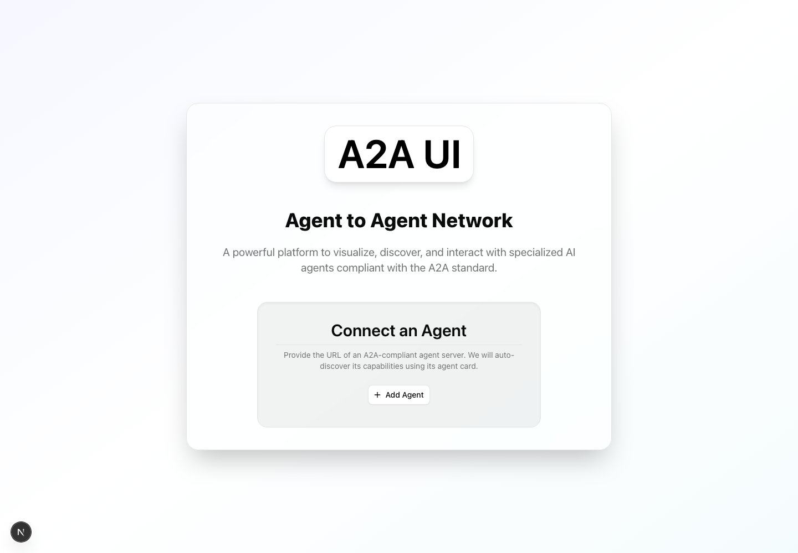
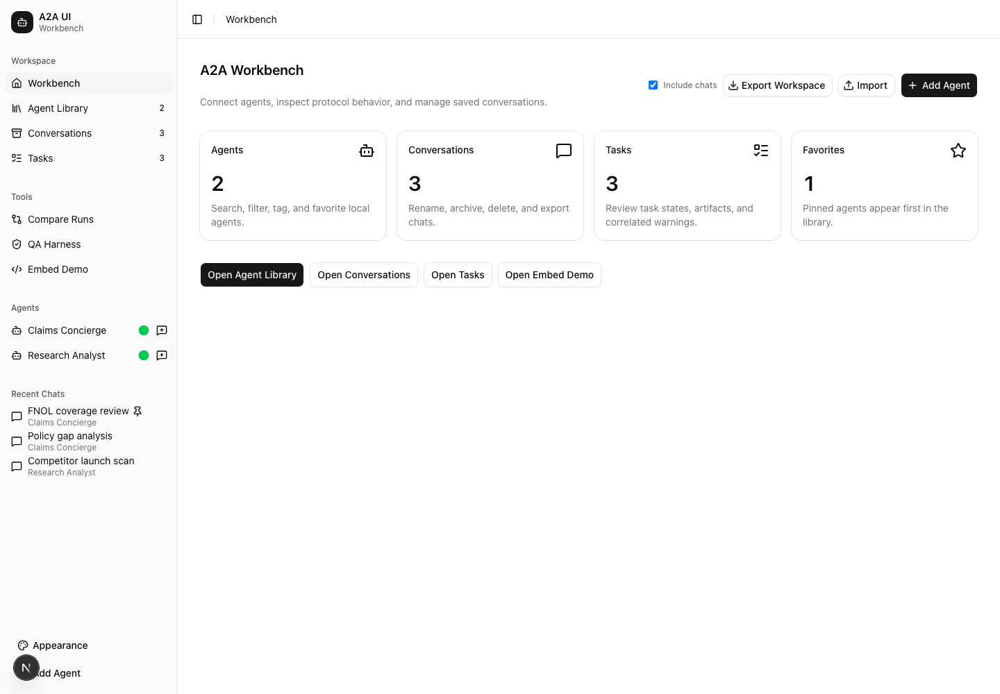
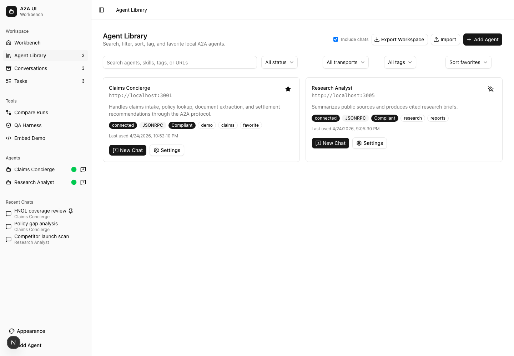
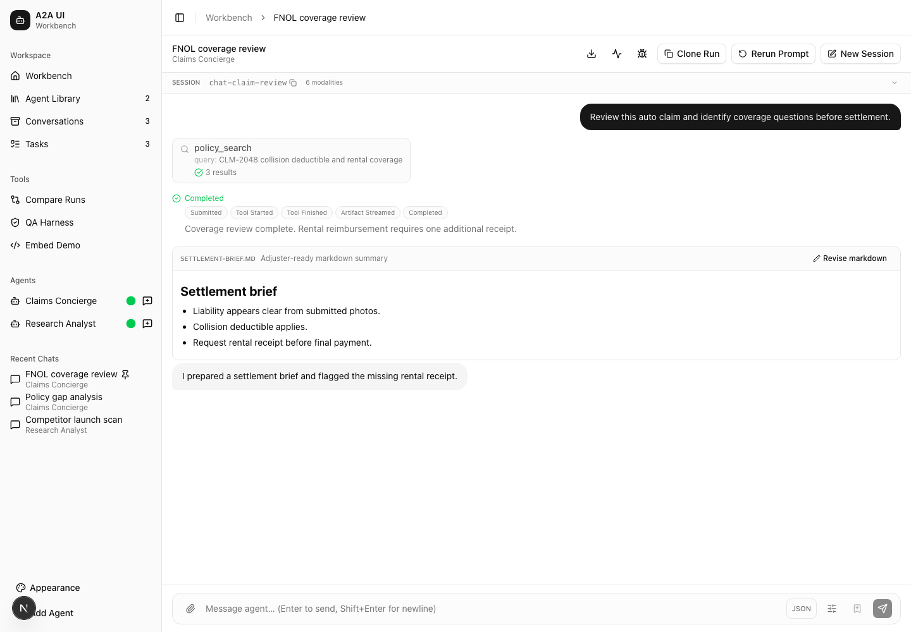
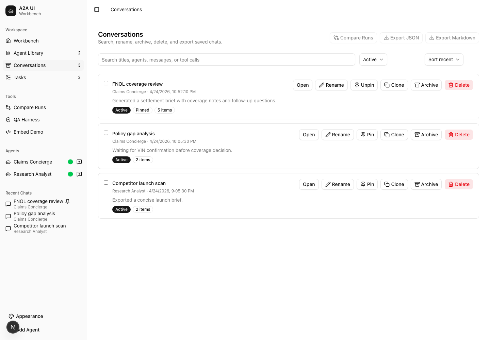
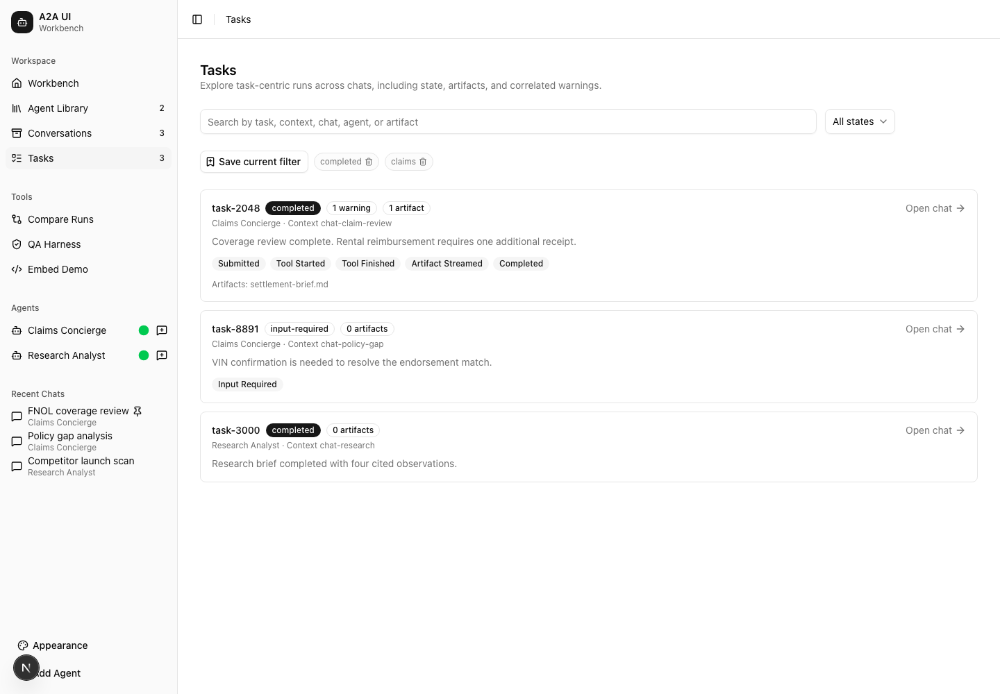
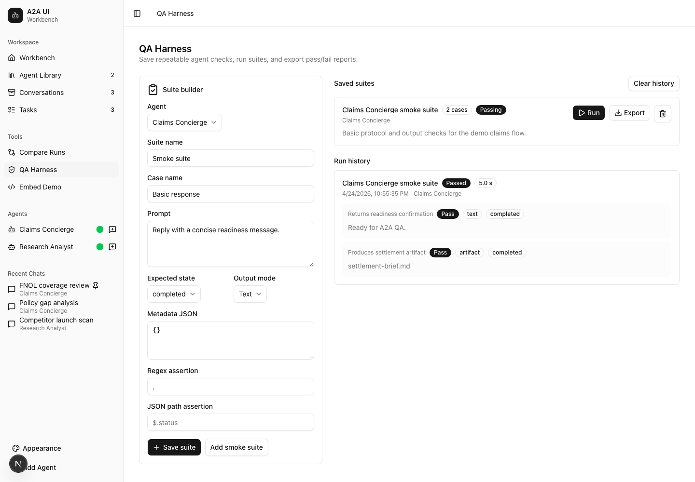

# A2A UI

A2A UI is a local-first developer workbench for building, testing, and debugging
Agent2Agent (A2A) protocol servers.

It gives you a browser UI for connecting to agents, inspecting agent cards,
chatting through the A2A transport, reviewing structured execution events,
iterating on task outputs, and running repeatable QA checks. The dashboard is
built on reusable hooks and embeddable chat primitives, so the same client
foundation can be used inside other apps.

## Screenshots















## What You Can Do

- Connect to A2A agents over HTTP or HTTPS.
- Configure per-agent auth, custom headers, display names, tags, and favorites.
- Inspect agent cards, declared capabilities, skills, modalities, and protocol
  compliance results.
- Chat with agents using persistent sessions, file attachments, custom metadata,
  streaming task updates, artifacts, tool calls, and raw JSON inspection.
- Explore normalized execution events across requests, responses, tasks,
  artifacts, tool calls, validation warnings, and transport timing.
- Browse task history with correlated artifacts and warnings.
- Clone sessions, rerun prompts, edit text or markdown artifacts, and compare
  saved runs by prompt, output, artifact content, and timing.
- Save and run QA suites with expected task states, output modes, regex
  assertions, JSON-path assertions, run history, and exportable reports.
- Render supported A2UI structured surfaces and richer A2A message parts.
- Import and export workspaces for local backup or sharing.
- Try the included Ollama-powered demo A2A server.

## Dashboard Areas

- `Workbench` shows workspace metrics and entry points.
- `Agent Library` manages connected agents, status, tags, favorites, settings,
  cards, auth, headers, and compliance checks.
- `Conversations` manages saved chats, pinned runs, archived chats, exports,
  clones, and reruns.
- `Tasks` provides a task-oriented view of A2A runs, states, artifacts, and
  warnings.
- `Compare Runs` compares two saved conversations.
- `QA Harness` builds and executes repeatable agent test suites.
- `Embed Demo` demonstrates the headless hooks and embeddable chat components.

## Embeddable Client Primitives

The dashboard uses the same primitives exposed for host applications:

- `useA2AConnection`
- `useA2ASession`
- `useA2AMessages`
- `useA2ADebug`
- `A2AChat`
- `A2AAgentCard`
- `A2ADebugPanel`

Host apps can provide an agent URL, auth configuration, custom headers, initial
metadata, hidden context, per-message context enrichers, and the desired
persistence mode.

## Getting Started

### Prerequisites

- Node.js 18 or newer
- npm
- An A2A-compatible agent server, or the bundled demo server

### Run The UI

```bash
npm install
npm run dev
```

Open [http://localhost:3000](http://localhost:3000).

### Run The Demo Server

The repo includes a sample A2A server in `server/` backed by Ollama.

```bash
cd server
cp .env.example .env
npm install
npm run dev
```

The demo server listens on [http://localhost:3001](http://localhost:3001) by
default. Configure `OLLAMA_HOST`, `OLLAMA_LLM_MODEL`, and
`OLLAMA_IMAGE_MODEL` in `server/.env` as needed.

### Run With Docker Compose

```bash
cp .env.example .env
cp server/.env.example server/.env
docker compose up --build
```

- UI: [http://localhost:3000](http://localhost:3000)
- Demo server: [http://localhost:3001](http://localhost:3001)

## Typical Workflow

1. Add an agent from the sidebar or import an existing workspace.
2. Review the fetched agent card, skills, modalities, and compliance results.
3. Start a conversation and send prompts, metadata, or attachments.
4. Use the debug panel and event explorer to inspect protocol behavior.
5. Review generated tasks and artifacts from the task explorer.
6. Clone or rerun conversations while iterating on agent behavior.
7. Compare two runs when validating regressions.
8. Save important checks in the QA harness and rerun them against the agent.

## Configuration Notes

- Agent credentials and workspace data are stored locally in the browser.
- Workspace import and export are JSON-based.
- Debug exports mask sensitive headers where possible.
- File attachment options are filtered against an agent's declared input modes.
- The same-origin proxy route helps browser clients reach agents that would
  otherwise fail cross-origin requests.

## Development

### Scripts

- `npm run dev` starts the Next.js development server.
- `npm run build` builds the production app.
- `npm run start` starts the production server.
- `npm run lint` runs ESLint.
- `npm run typecheck` runs TypeScript without emitting files.
- `npm run format` formats the repo with Prettier.
- `npm run test` runs the Vitest suite.
- `npm run test:watch` runs Vitest in watch mode.
- `npm run test:coverage` runs tests with coverage.
- `npm run test:e2e` runs Playwright smoke tests.

### Project Structure

```text
a2a-ui/
├── app/                    # Next.js App Router pages and API routes
├── components/             # Dashboard, chat, and shared UI components
├── hooks/                  # Headless A2A connection, session, message, and debug hooks
├── lib/a2a/                # A2A message parts, modalities, A2UI, and event helpers
├── lib/features/           # Redux slices for agents, chats, QA, and workbench state
├── lib/utils/              # Auth, compliance, protocol reports, proxy, and workspace helpers
├── server/                 # Bundled demo A2A server
├── tests/                  # Vitest unit and integration tests
└── e2e/                    # Playwright smoke tests
```

### Tech Stack

- Next.js 16 App Router
- React 19
- TypeScript
- Tailwind CSS 4
- shadcn/ui and Radix UI
- Redux Toolkit and React Redux
- IndexedDB via `idb`
- `@a2a-js/sdk`
- Vitest, Testing Library, and Playwright

## Useful References

- [A2A Protocol Specification](https://a2a-protocol.org/latest/specification/)
- [JSON-RPC 2.0 Specification](https://www.jsonrpc.org/specification)
- [Next.js Documentation](https://nextjs.org/docs)
